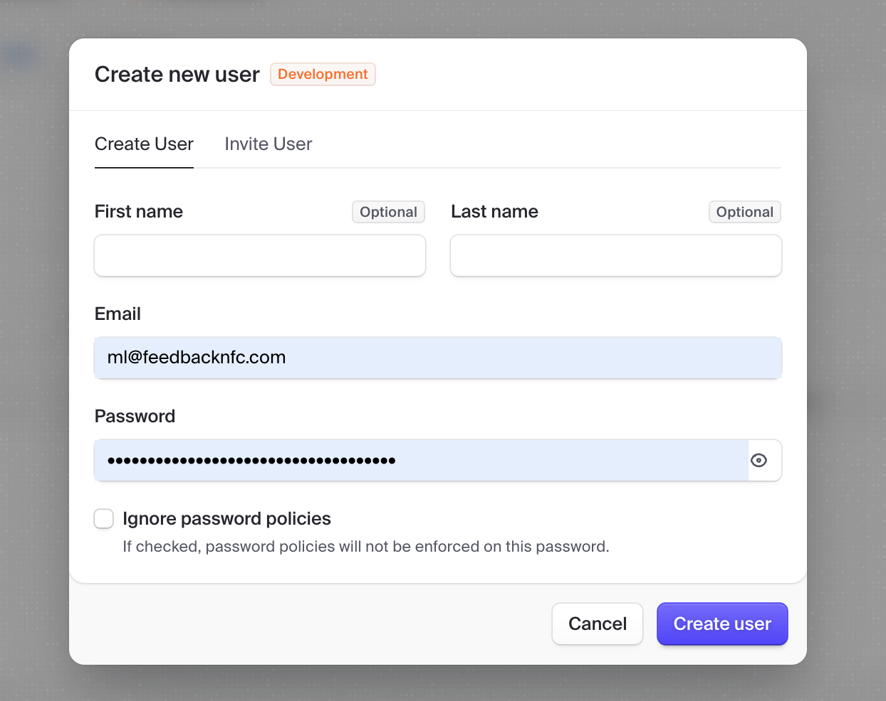
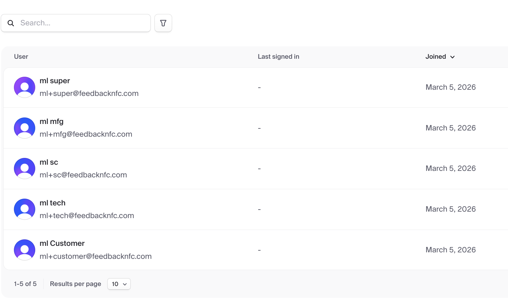
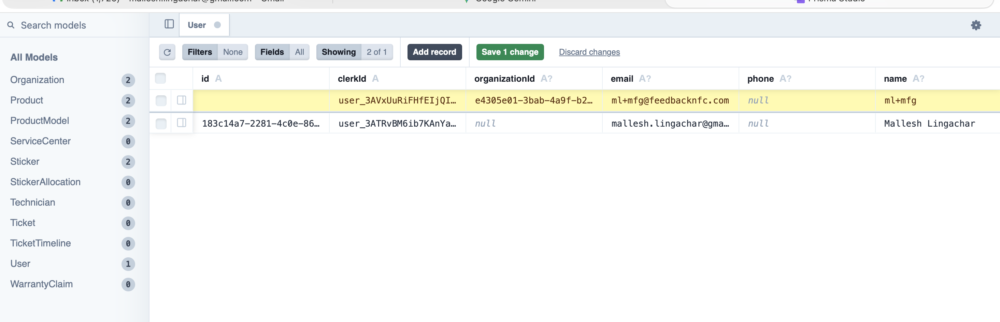
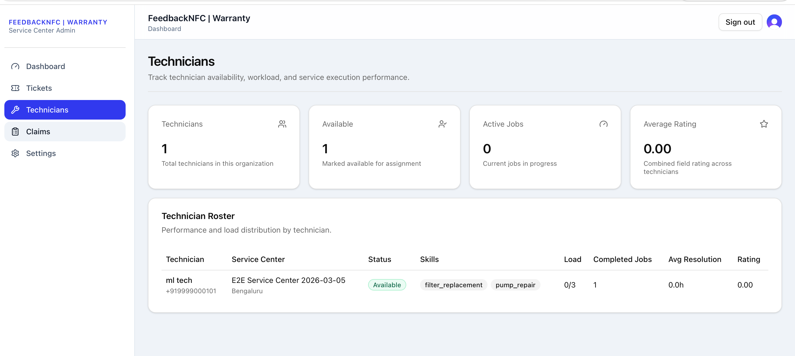
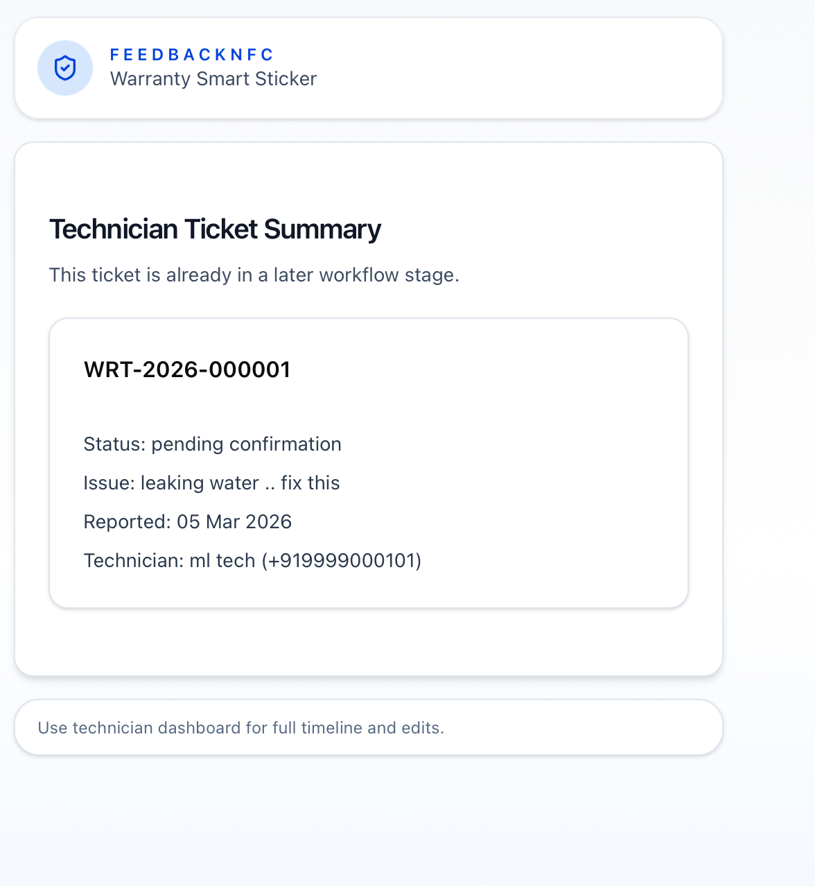
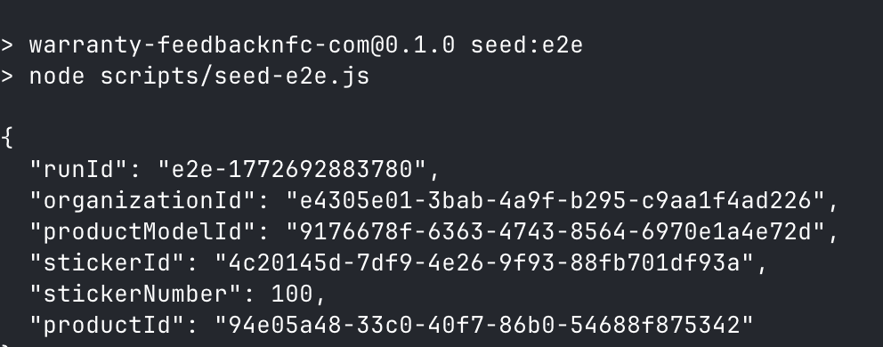
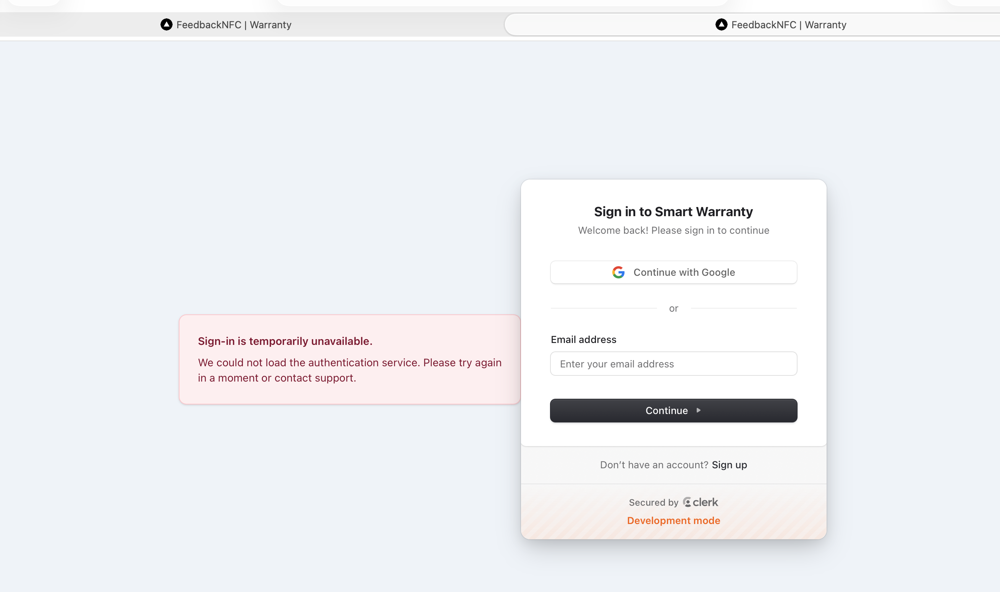
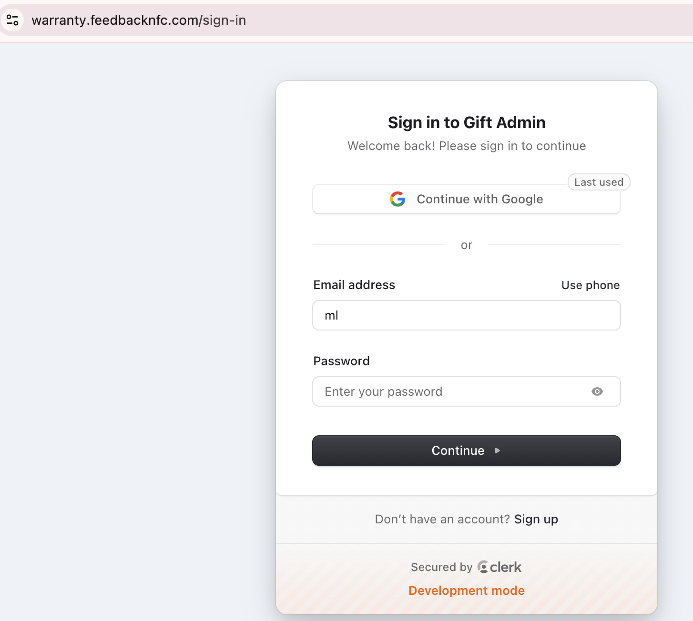
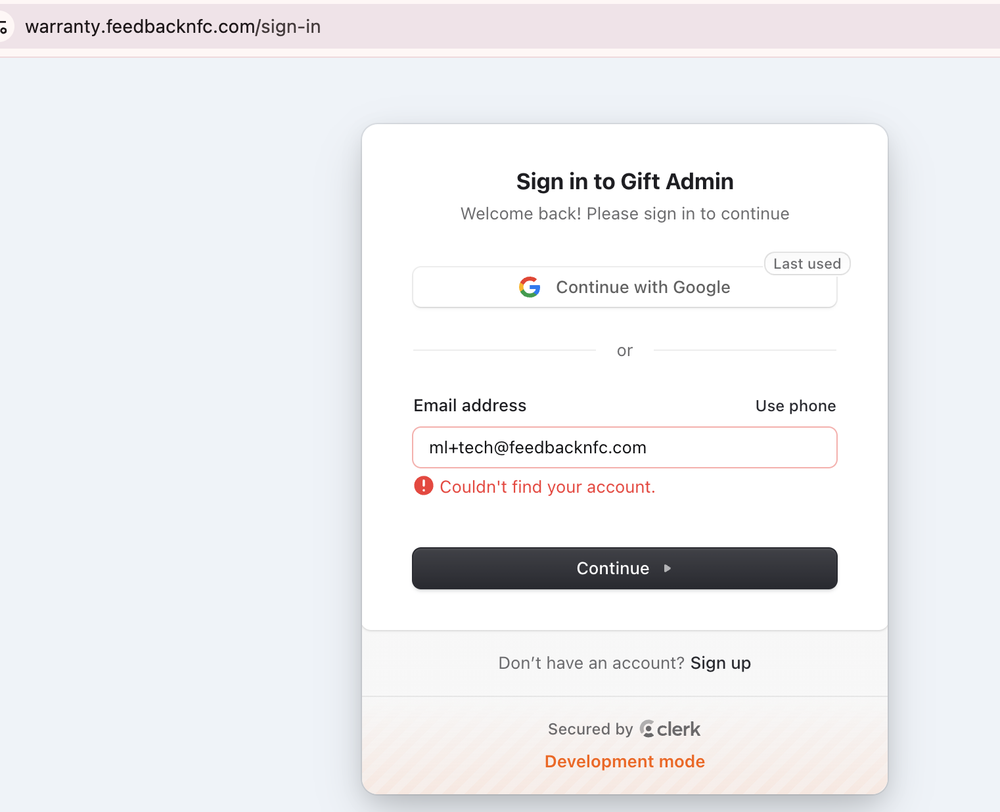

# FeedbackNFC Warranty Platform — User Manual

**App:** `warranty.feedbacknfc.com`  
**Last updated:** 2026-03-05  
**Scope:** Manufacturer Admin, Service Center Admin, Technician, Customer  

> This is a living document. Some screens/metrics may change as features ship.

---

## Table of contents

1. Overview (roles + objects)
2. Validated end-to-end workflow
3. Ticket + claim lifecycle (what happens when)
4. Setup (Clerk users + platform roles)
5. Manufacturer Admin guide
6. Service Center Admin guide
7. Technician guide (mobile-first)
8. Customer guide (NFC/QR tap flow)
9. Analytics & KPIs (how it’s calculated)
10. Manual QA flow (using test sticker `100`)
11. Troubleshooting

---

## 1) Overview (roles + objects)

### Roles

- **Manufacturer Admin**
  - Owns product catalog (models), sticker allocations, and reimbursement decisions (claims).
  - Views cross-service-center performance and analytics.
- **Service Center Admin**
  - Operates service delivery for a service center organization.
  - Onboards technicians, monitors tickets (service queue), and tracks claims outcomes.
- **Technician**
  - Receives assigned jobs, updates job status (enroute → start → complete), uploads proof, and closes the service work.
- **Customer**
  - Scans/taps the sticker to activate warranty, raise service requests, track status, and confirm resolution.

### Core objects

- **Sticker** — physical NFC/QR sticker mapped to a number: `/nfc/{stickerNumber}`  
- **Product Model** — manufacturer’s SKU / model catalog (warranty duration, common issues, required skills)  
- **Product (Unit)** — a specific product unit bound to a sticker (serial number, installation date, customer details)  
- **Ticket** — service request raised by customer; moves through workflow states  
- **Claim** — reimbursement record generated for warranty work (auto-generated after customer confirmation)

---

## 2) Validated end-to-end workflow (how the system works)

Your summary is correct with two important clarifications:

1) **Technicians are managed by Service Center Admins** (not by manufacturers).  
   Manufacturer Admins can **view** technicians per service center (read-only) via Service Network.

2) **Claims are auto-generated after customer confirmation**, not immediately at technician completion.  
   Technician completion puts the ticket into **`pending_confirmation`**; customer confirmation triggers claim creation.

### End-to-end flow (validated)

1. **Manufacturer Admin**
   - Creates **Product Models**.
   - Allocates **Sticker ranges** to product models and binds stickers to product units.
   - Authorizes **Service Centers** in the service network.
2. **Customer**
   - First scan/tap on a bound product triggers **Warranty Activation**.
   - Later scans show product details, ticket tracker, and confirmation actions.
3. **Customer creates a service request**
   - Customer reports an issue on the sticker page.
   - System creates a **Ticket** and runs **AI assignment** (skill + location matching).
4. **Service Center Admin + Technician execution**
   - Ticket appears in the service center queue.
   - Assigned technician sees it in **My Jobs**.
   - Technician updates status (accept/enroute → start work → complete work).
5. **Customer confirmation**
   - After technician marks the job complete, ticket becomes **pending confirmation**.
   - Customer scans/taps again (or uses a shared link) to **Confirm Resolution**.
6. **Claim generation + manufacturer review**
   - System auto-generates a warranty claim after customer confirmation.
   - Manufacturer reviews: approve/reject (and later mark paid/closed as needed).
7. **Analytics**
   - Analytics pages summarize tickets, claims, resolution times, ratings, and product performance.

---

## 3) Ticket + claim lifecycle (what happens when)

### Ticket states (simplified)

- `reported` → customer created a service request
- `assigned` → system assigned a service center + technician
- `technician_enroute` → technician accepted job and is travelling
- `work_in_progress` → technician started work
- `pending_confirmation` → technician completed work; customer must confirm
- `resolved` → customer confirmed resolution (claim can be generated)
- `closed` → final/archived state (optional; depends on ops policy)
- `escalated` / `reopened` → requires intervention (no in-app manual assignment UI yet)

### Claim states (simplified)

- `auto_generated` → created by system after customer confirmation
- `under_review` / `approved` / `rejected` → manufacturer decision
- `paid` / `closed` → settlement bookkeeping

---

## 4) Setup (Clerk users + platform roles)

The platform uses **Clerk** for authentication, and a **Neon Postgres + Prisma** DB to store role + organization context.

### A) Create the user in Clerk first

In the Clerk dashboard:

1. Create the user (or invite them).
2. Copy their **Clerk User ID** (format: `user_...`).

Example list of created users:

### B) Ensure the app has a DB `users` row

The app creates/updates a DB user row automatically on sign-in for most users.

For technicians, we explicitly create/update the DB row via the **Service Center → Add Technician** flow (below).

Example `User` table record (DB):

### C) Service Center Admin: onboard technicians (recommended path)

1. Sign in as **Service Center Admin**
2. Go to `Dashboard → Technicians`
3. Click **Add Technician**
4. Paste the Clerk User ID (`user_...`)
5. Fill: name, phone, skills, max concurrent jobs
6. Pick the service center
7. Save

This creates:

- `users` row (role = `technician`, organization_id = service center org)
- `technicians` row (skills, availability, service_center_id)

---

## 5) Manufacturer Admin guide

### Navigation

After sign-in, Manufacturer Admins are redirected to:

- `Dashboard → /dashboard/manufacturer`

Key sections:

- **Products** (`/dashboard/manufacturer/products`)  
  Create/edit product models (model number, warranty months, common issues, required skills).
- **Stickers** (`/dashboard/manufacturer/stickers`)  
  Allocate sticker ranges to models (inventory + allocation history).
- **Tickets** (`/dashboard/manufacturer/tickets`)  
  Monitor service execution across all products for your org.
- **Service Network** (`/dashboard/manufacturer/service-network`)  
  Authorize service centers and view their technician roster + performance metrics.
- **Claims** (`/dashboard/manufacturer/claims`)  
  Review auto-generated claims and approve/reject amounts.
- **Analytics** (`/dashboard/manufacturer/analytics`)  
  Product performance + cost trends (derived from tickets/claims).
- **Settings** (`/dashboard/manufacturer/settings`)

### Common manufacturer tasks (step-by-step)

1. **Create Product Models**
   - Go to `Products` → `Add Product Model`
   - Fill required fields (Name, Category, Model Number, Warranty Duration)
2. **Allocate Stickers**
   - Go to `Stickers`
   - Allocate a sticker range to a product model
3. **Authorize Service Centers**
   - Go to `Service Network`
   - Click `Authorize New Center`
4. **Review Claims**
   - Go to `Claims`
   - Open a claim → review documentation → approve/reject

---

## 6) Service Center Admin guide

### Navigation

Service center admins use:

- `Tickets` (`/dashboard/tickets`) — live queue + SLA indicators
- `Technicians` (`/dashboard/technicians`) — roster + availability
- `Claims` (`/dashboard/claims`) — pipeline and outcomes
- `Settings` (`/dashboard/settings`)

### Add technicians (where you onboard more technicians)

Use the **Technicians** page:

Steps:

1. Create the technician in **Clerk** (or invite).
2. Copy the Clerk user id (`user_...`).
3. `Dashboard → Technicians → Add Technician`.
4. Save.

### Tickets (what you should monitor)

In `Tickets`, watch:

- **Open Tickets** — requires dispatch + monitoring
- **Pending Confirmation** — technician completed; waiting on customer confirmation
- **Escalated/Reopened** — needs intervention (manual escalation workflow is still evolving)

---

## 7) Technician guide (mobile-first)

Technicians work from the dashboard + sticker tap flow.

### Technician dashboard pages

- **My Jobs** (`/dashboard/my-jobs`)
  - Assigned tab: new jobs to accept
  - In Progress tab: active work
  - Completed tab: history
- **Schedule** (`/dashboard/schedule`) — daily/weekly schedule view
- **My Performance** (`/dashboard/my-performance`) — jobs completed, avg resolution time, rating, claims value generated

### On a job (expected technician flow)

1. Open `My Jobs`
2. Tap a job → `Accept & Start Navigation`
3. When on-site → `Start Work`
4. After repair → `Complete Work`
   - Add resolution notes (required)
   - Add parts used (if any)
   - Upload before/after photos (optional)
5. Ticket becomes **Pending Confirmation**

### When customer confirmation is pending (what to do)

If you see **Pending Confirmation**, the customer still needs to confirm.

The NFC sticker page gives a technician a “Waiting for customer confirmation” callout and a customer link to share.

Example pending confirmation summary:

Recommended: copy/share the customer link so they can confirm immediately.

---

## 8) Customer guide (NFC / QR tap flow)

Customers do not need to sign in to start:

- Sticker route: `https://warranty.feedbacknfc.com/nfc/{stickerNumber}`

### Customer actions by state

1. **Pending activation**
   - First scan/tap → fills activation info → warranty becomes active
2. **Active + no open ticket**
   - Customer sees product details + can create a service request
3. **Open ticket exists**
   - Customer sees tracker (status timeline + technician details)
4. **Pending confirmation**
   - Customer sees **Confirm Resolution**
   - Confirming resolution triggers automatic claim generation

---

## 9) Analytics & KPIs (how it’s calculated)

Analytics is derived from:

- tickets (status transitions, timestamps)
- technician performance (completion counts, average resolution durations)
- claims (amounts + outcomes)
- product models (issue categories, volumes)

Examples of KPIs:

- Average assignment latency (Reported → Assigned)
- Average resolution time (Work started → Work completed)
- Pending claims amount (auto_generated/submitted/under_review)
- Top issues by model (issueCategory frequency)

---

## 10) Manual QA flow (using test sticker `100`)

Use this sticker URL as a test card:

- `https://warranty.feedbacknfc.com/nfc/100`

> If you must use `https://feedbacknfc.com/nfc/100`, ensure the root-domain router redirects warranty stickers to `warranty.feedbacknfc.com`. That redirect may be managed outside this repository.

### Recommended QA checklist

1. **Customer activation**
   - Open `/nfc/100` in an incognito window
   - If pending activation: submit activation form
2. **Create service request**
   - Report issue with a description
   - Verify ticket status becomes `reported` then `assigned`
3. **Service Center Admin checks queue**
   - Sign in as service center admin
   - Open `Dashboard → Tickets` and confirm ticket appears
4. **Technician executes job**
   - Sign in as technician
   - `My Jobs` → accept → start → complete with notes
   - Verify status becomes `pending_confirmation`
5. **Customer confirms**
   - Back on `/nfc/100` (as customer/anonymous)
   - Confirm resolution
   - Verify claim is auto-generated
6. **Claims**
   - Service center: `Dashboard → Claims` shows new claim
   - Manufacturer: `Dashboard → Claims` can approve/reject

If you’re using the E2E seeding script locally, you may see output like:

---

## 11) Troubleshooting

### “Sign-in is temporarily unavailable”

This usually indicates Clerk could not load or the environment keys/domain settings are wrong.

Checks:

- Confirm production uses correct Clerk instance/keys
- Confirm Clerk app allows your domain (`warranty.feedbacknfc.com`)
- Confirm Vercel env vars are set for the production deployment

### Sign-in title shows something unexpected (e.g., “Gift Admin”)

The sign-in UI title comes from Clerk “Application name / appearance” settings.

If you see “Couldn’t find your account”, the user likely does not exist in the current Clerk instance:

Fix:

- Ensure you created the user in the same Clerk application/environment (dev vs prod)
- Ensure you’re on the correct domain pointing to the intended Clerk keys

